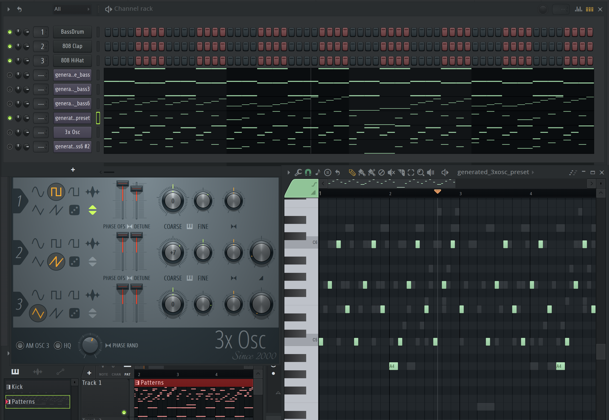
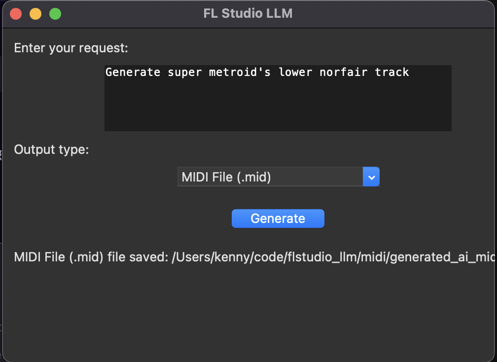

# FL Studio LLM Assisted Music Generation

A simple application that generates MIDI patterns and Serum presets based on text input using AI.



<audio controls src="wav/sample01.wav"><a href="wav/sample01.wav" target="_blank">wav/sample01.wav</a></audio>
<audio controls src="wav/sample02.wav"><a href="wav/sample02.wav" target="_blank">wav/sample02.wav</a></audio>
<audio controls src="wav/sample03.wav"><a href="wav/sample03.wav" target="_blank">wav/sample03.wav</a></audio>
<audio controls src="wav/sample04.wav"><a href="wav/sample04.wav" target="_blank">wav/sample04.wav</a></audio>
<audio controls src="wav/sample05.wav"><a href="wav/sample05.wav" target="_blank">wav/sample05.wav</a></audio>
<audio controls src="wav/sample06.wav"><a href="wav/sample06.wav" target="_blank">wav/sample06.wav</a></audio>
<audio controls src="wav/sample07.wav"><a href="wav/sample07.wav" target="_blank">wav/sample07.wav</a></audio>


## Setup

1. Install Python 3.8 or higher
2. Install the required dependencies:
   ```bash
   pip install -r requirements.txt
   ```

## Usage

1. Start the server:
   ```bash
   python server.py
   ```

2. Start the client:
   ```bash
   python client.py
   ```



3. Enter your text request in the client window and select the desired output type (MIDI, Serum FXP, or 3xOsc FST).

Note that Serum not working yet.

## API Endpoints & curl Examples

### Generate MIDI file
```bash
curl -X POST http://localhost:8000/generate/midi \
  -H "Content-Type: application/json" \
  -d '{"text": "produce a techno track with a hard-bass dirty feel to it"}' \
  --output generated_ai_midi.mid
```

### Generate Serum FXP file
```bash
curl -X POST http://localhost:8000/generate/fxp \
  -H "Content-Type: application/json" \
  -d '{"text": "create a dirty bass preset for techno"}' \
  --output generated_serum_preset.fxp
```

### Generate 3xOsc JSON preset (for reference/manual use)
```bash
curl -X POST http://localhost:8000/generate/3xosc \
  -H "Content-Type: application/json" \
  -d '{"text": "fat detuned saw bass"}' \
  --output generated_3xosc_preset.json
```

### Generate 3xOsc FST file (for FL Studio)
```bash
curl -X POST http://localhost:8000/generate/3xosc-fst \
  -H "Content-Type: application/json" \
  -d '{"text": "chaotic metallic bass with lots of detune and phase"}' \
  --output generated_3xosc_preset.fst
```

## Features

- Text-to-MIDI pattern generation
- Text-to-Serum preset generation
- Text-to-3xOsc preset generation (JSON and FST)
- Simple GUI interface
- REST API for integration with other applications

## Development

This project uses:
- FastAPI for the server
- Tkinter for the client GUI
- Mido for MIDI handling
- Python-OSC for FL Studio communication 